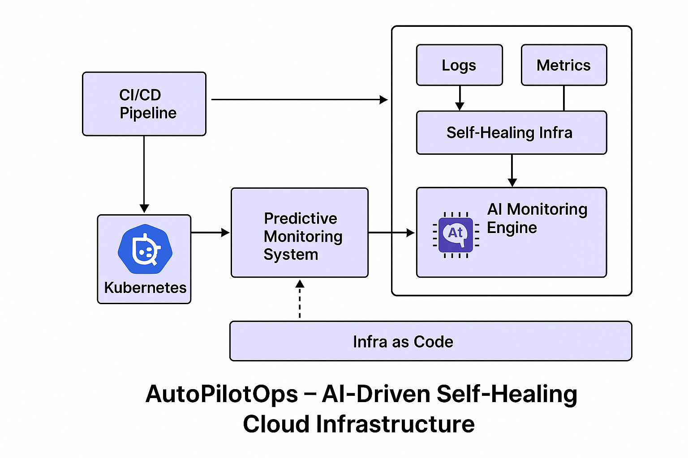

# AutoPilotOps-AI-Driven-Self-Healing-Cloud-Infrastructure

## Phase 1: Architecture & Planning

- Architecture Drawing



### 🧠 Architecture Breakdown

- 🔁 1. CI/CD Pipeline (Bottom Left)
  This is where application builds, tests, and deployments
  begin.

- Tools like GitHub Actions, GitLab CI, or Jenkins automate
  the pipeline. The CI/CD pipeline pushes deployments to
  Kubernetes.

### ☸️ 2. Kubernetes Cluster

- Acts as the central environment where all workloads (apps,
  microservices) run.

- This cluster is monitored continuously and is the heart of
  the infrastructure.

- It sends telemetry (logs/metrics) to the monitoring stack.

### 📊 3. Observability Stack

- Logs (from apps and system events) and Metrics (CPU, memory,
  latency) are collected.

- These feed into the Self-Healing Infrastructure layer, which
  detects abnormal behavior.

### 🤖 4. Self-Healing Infra + AI Monitoring Engine
  
- The self-healing engine receives logs/metrics and forwards
  them to the AI Monitoring Engine.

- The AI engine (e.g., Isolation Forest, LSTM models) analyzes
  patterns and predicts issues before they occur.

- It can trigger alerts, restart pods, scale deployments, or
  notify the CI/CD system to rollback.

### 🛠️ 5. Infra as Code (IaC)

- This layer ensures the entire infrastructure is codified
  using Terraform.

- It connects with the CI/CD pipeline to automate changes or
  rollbacks when issues are detected.
- AI can detect drift from desired state and suggest or auto-
  correct them.

**🔄 Flow Summary:**
Code changes flow through the CI/CD pipeline → deploy to Kubernetes.

Kubernetes workloads generate logs and metrics.

Observability stack captures data → AI engine makes predictions.

If anomalies are detected:

Auto-heal the infra (restart pods, scale up/down).

Trigger rollbacks or infra changes via IaC and CI/CD.*

# 🧰 Tooling Stack Breakdown

## 1. 🏗️ CI/CD Pipeline

| Area      | Tool                          |
|-----------|------------------------------|
| CI        | GitHub Actions               |
| CD to Kubernetes | ArgoCD (GitOps deployment) |
| CD for IaC | Terraform Cloud |

✅ **Why:**

- GitHub Actions is native, fast, and integrates easily with both app and infra workflows.
- ArgoCD provides declarative, GitOps-style sync into Kubernetes.
- Terraform Cloud offers UI, state management, and automation for infra provisioning.

## 2. ☸️ Kubernetes Cluster

| Area       | Tool                     |
|------------|-------------------------|
| Cluster    | EKS (AWS)                |
| Local Dev  | Minikube                 |
| App Config | Helm (templating)        |

✅ **Why:**

- EKS provides production-grade Kubernetes with security and scalability.
- Helm simplifies reusable deployments (e.g., Prometheus, apps, etc.).

## 3. 📊 Observability Stack

| Area          | Tool                     |
|--------------|-------------------------|
| Metrics       | Prometheus               |
| Logs         | Loki (Grafana stack)      |
| Visualization | Grafana                   |

✅ **Why:**

- All tools are CNCF-compliant, work well with Kubernetes, and support alerting and custom dashboards.

## 4. 🧠 Predictive AI Monitoring & Self-Healing

| Area                 | Tool                                         |
|----------------------|---------------------------------------------|
| Anomaly Detection   | Python ML (e.g., Isolation Forest, LSTM)   |
| Auto-healing Actions | Kubernetes Operators, Argo Workflows, or custom controller |
| Alert System        | Prometheus Alertmanager + Slack/Webhook integration |

✅ **Why:**

- Python gives control to experiment with AI/ML algorithms.
- Kubernetes Operators or custom controllers automate actions like restart, scale, or rollback.
- Alertmanager integrates with communication tools like Slack or email.

## 5. 📜 Infrastructure as Code (IaC)

| Area             | Tool                             |
|----------------|---------------------------------|
| IaC             | Terraform                        |
| State Storage   | Remote S3 + DynamoDB            |
| Infra Provisioning | VPC, EKS, S3, etc., via Terraform modules |

✅ **Why:**

- Terraform allows full control over AWS infrastructure.
- Version-controlled and repeatable for consistent deployments.

## ✅ Summary Table (Tool Map)

| Layer         | Tools                              |
|--------------|----------------------------------|
| CI/CD        | GitHub Actions, ArgoCD, Terraform Cloud |
| Kubernetes   | EKS, Helm                         |
| Observability | Prometheus, Loki, Grafana       |
| AI Monitoring | Python ML, Prometheus alerts, K8s Operator |
| IaC          | Terraform                        |

## 🗂️ Project Directory Structure

```plaintext
AutoPilotOps-AI-Driven-Self-Healing-Cloud-Infrastructure/
├── README.md                         # Project documentation
├── .gitignore                         # Git ignores for unnecessary files
├── .github/
│   └── workflows/                     # GitHub Actions CI/CD configurations
├── terraform/
│   ├── main.tf                         # Terraform modules for infrastructure (EKS, S3, VPC, etc.)
│   ├── variables.tf                     # Terraform variables
│   └── environments/
│       ├── dev/                        # Development environment configurations
│       └── prod/                        # Production environment configurations
├── k8s/
│   ├── helm-charts/                     # Helm charts for services like Prometheus, Grafana, etc.
│   └── manifests/                        # Kubernetes raw YAML manifests (if needed)
├── ai-monitoring/
│   ├── model/                           # Machine learning model training code
│   ├── service/                         # FastAPI application serving AI predictions
│   └── data/                            # Sample logs and metrics datasets for monitoring
├── operator/
│   └── self-healer/                     # Kubernetes controller/operator for auto-remediation
├── scripts/
│   └── simulate_failure.sh              # Script for simulating failures to test AI-based remediation
└── docs/
    └── architecture.md                   # System design documentation and architecture diagrams
```

## ✅ Step-by-Step Setup

1. 🧱 Initialize Git Repo

```bash
mkdir AutoPilotOps-AI-Driven-Self-Healing-Cloud-Infrastructure && cd AutoPilotOps-AI-Driven-Self-Healing-Cloud-Infrastructure
git init
echo "# AutoPilotOps" > README.md
touch .gitignore
```

2. 🛠️ Install Tooling Locally (Dev Setup)
Install these locally:

- Terraform

- kubectl

- helm

- minikube

- Python 3.11+

- pipenv/poetry(for Python project)

- Docker

- Tilt or Skaffold (optional for rapid local dev)
